# Healthcare Information Assistant - System Architecture

## Overview

This project implements a Retrieval-Augmented Generation (RAG) based Healthcare Information Assistant.
The system retrieves information from trusted medical sources and generates grounded responses using Gemini.

## Architecture Diagram

```mermaid
flowchart LR

    subgraph Knowledge_Base
        A1["MedQuAD Dataset (CSV)"]
        A2["Medical Guidelines (PDFs)"]
    end

    subgraph Ingestion_Pipeline
        B1["Document Loading"]
        B2["Recursive Character Splitter"]
        B3["SentenceTransformer Embeddings<br/>all-MiniLM-L6-v2"]
        B4["Gemini Embeddings<br/>gemini-embedding-001"]
    end

    subgraph Vector_Database
        C["ChromaDB"]
    end

    subgraph Application
        D["Streamlit Interface"]
        E["User Query"]
        F["Query Embedding"]
        G["Similarity Search"]
        H["Retrieved Context"]
        I["Prompt Builder"]
        J["Gemini 2.5 Flash"]
        K["Grounded Response + Citations"]
    end

    A1 --> B1
    A2 --> B1

    B1 --> B2

    B2 --> B3
    B2 --> B4

    B3 --> C
    B4 --> C

    D --> E
    E --> F
    F --> G
    G --> C
    C --> H
    H --> I
    I --> J
    J --> K
    K --> D

    style C fill:#FFE8CC,stroke:#333,stroke-width:2px
    style J fill:#D6EAF8,stroke:#333,stroke-width:2px
```

## Workflow

1. Medical documents are collected from MedQuAD and trusted medical guideline PDFs.
2. Documents are split into smaller chunks using Recursive Character Splitter.
3. Chunks are converted into vector embeddings.
4. Embeddings are stored in ChromaDB.
5. A user's question is embedded.
6. ChromaDB retrieves the most relevant document chunks.
7. Retrieved context is combined with a prompt template.
8. Gemini generates an answer only from the retrieved evidence.
9. The response is displayed along with citations.
