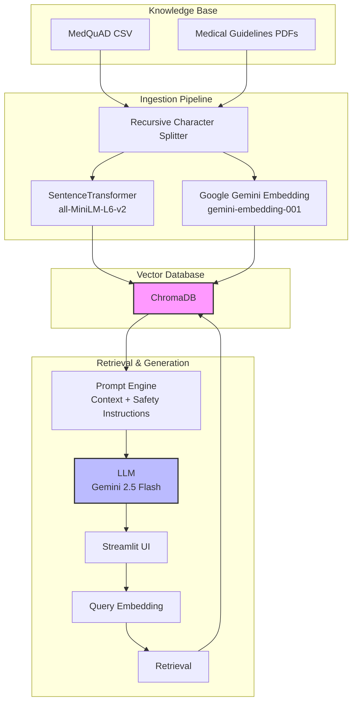

```mermaid
graph TD
    subgraph DataSources["Knowledge Base"]
        A1["MedQuAD CSV"]
        A2["Medical Guidelines PDFs"]
    end

    subgraph Ingestion["Ingestion Pipeline"]
        B1["Recursive Character Splitter"]
        B2["SentenceTransformer<br/>all-MiniLM-L6-v2"]
        B3["Google Gemini Embedding<br/>gemini-embedding-001"]
    end

    subgraph Storage["Vector Database"]
        C["ChromaDB"]
    end

    subgraph RAG["Retrieval & Generation"]
        D["Streamlit UI"]
        E["Query Embedding"]
        F["Retrieval"]
        G["Prompt Engine<br/>Context + Safety Instructions"]
        H["LLM<br/>Gemini 2.5 Flash"]
    end

    A1 --> B1
    A2 --> B1
    B1 --> B2
    B1 --> B3
    B2 --> C
    B3 --> C

    D --> E
    E --> F
    F --> C
    C --> G
    G --> H
    H --> D

    style C fill:#f9f,stroke:#333,stroke-width:2px
    style H fill:#bbf,stroke:#333,stroke-width:2px
```
